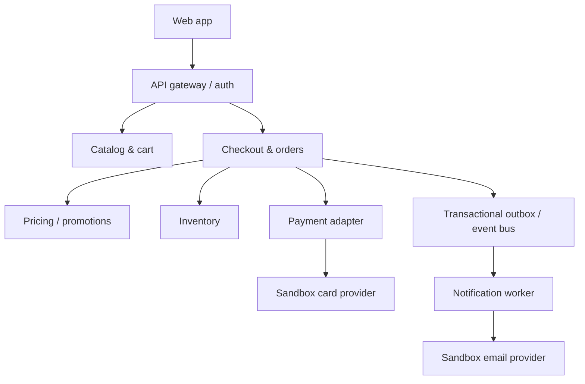

Architecture Design: HarborCart Ecommerce
Version: 1.0 | Status: Synthetic sample for agent testing | Companion: Ecommerce_BRD_Sample.md
This is a proposed reference design for the fictional HarborCart application. API contracts and failure handling are test oracles, not claims about a running system.

1. Context and design goals
Implement BR-01–BR-17 with stable checkout semantics, inventory safety, auditable payment outcomes, and observable asynchronous notifications. Clients are a responsive web application and a support console. Use USD decimal amounts as integer cents in storage; render two decimals in APIs. All timestamps are ISO 8601 UTC. Public API base path: /api/v1.
2. Component view

Catalog store holds products and carts. Orders database holds quotes, order records, checkout requests, and payment attempt references. Inventory database holds available units and reservations. An outbox row is committed with each order state transition, then published at least once; consumers deduplicate by event ID. Authentication provides user ID and role. Guest carts use opaque session ID; guest order retrieval uses verified email/code.
3. Ownership and data model
Entity    Key fields / states    Owner / invariant
Product    SKU, status ACTIVE/INACTIVE, priceCents, revision    Catalog; price revision increments on change.
Cart    cartId, owner/session, lines {SKU, qty}, revision    Catalog; optimistic revision prevents lost updates.
Quote    quoteId, cart snapshot, price revisions, address, discountCents, shippingCents, taxCents, totalCents, expiresAt    Checkout; immutable, 10-minute validity.
Reservation    reservationId, SKU, qty, expiresAt, status HELD/ALLOCATED/RELEASED/EXPIRED    Inventory; one reservation per checkout attempt, transition once.
PaymentAttempt    attemptId, providerKey, providerRef, amountCents, status PENDING/UNKNOWN/AUTHORIZED/DECLINED/VOIDED/REFUNDED    Payments; providerKey stable across retries.
Order    orderId, orderNumber, owner or guest email digest, quote snapshot, status CONFIRMED/FULFILLING/SHIPPED/CANCEL_PENDING/CANCELLED    Orders; unique checkout request and payment reference.
CheckoutRequest    idempotencyKey, user/session scope, payloadHash, state, response, orderId    Checkout; unique(scope, key), retain 24 hours minimum.
OutboxEvent    eventId, aggregateId, type, version, payload, publishedAt    Orders; unique event ID for consumer deduplication.


Money: discount is allocated to eligible item totals; round the aggregate discount to cents using half-up. Tax is computed once on post-discount merchandise plus shipping; compare integer cents. Changing address, cart, price revision, or promotion invalidates a quote.
4. Public contract examples
Endpoint    Request / important responses    BR coverage
GET /products?q=&page=1&pageSize=20    200 products, pagination; max pageSize 100    BR-01
GET /products/{sku}    200 product; 404 inactive/unknown    BR-02
PUT /cart/lines/{sku}    { "quantity": 2, "expectedRevision": 3 }; 200 cart; 409 stale revision; 422 invalid quantity    BR-03–04
POST /checkout/quotes    { "cartId": "cart-1", "address": { ... }, "promotionCode": "SAVE10" }; 201 immutable quote; 422 address/promo; 409 unavailable item    BR-05–10
POST /checkout/orders    Headers Idempotency-Key: <uuid>; body { "quoteId": "q-1", "paymentToken": "tok_approve" }; 201 confirmed order; retry 200 same order; 409 quote/stock/key conflict; 422 payment decline; 202 payment pending reconciliation    BR-09, BR-11–13
GET /checkout/requests/{key}    200 with PENDING, UNKNOWN, CONFIRMED, or FAILED and order reference when known; scoped to caller    BR-11–12
GET /orders / GET /orders/{id}    Authenticated owner list/detail; 404 other owner's detail    BR-15, BR-17
POST /orders/{id}/cancel    200 cancelled or 202 cancel pending; 409 fulfillment started; 404 unauthorized    BR-16–17


Error envelope: { "code": "OUT_OF_STOCK", "message": "One item is unavailable", "details": { "sku": "BAG-BLUE" }, "correlationId": "..." }. Use status codes above as sample contracts; payment provider response bodies remain internal. Do not send a full card number or CVV to any HarborCart endpoint. Provider widget yields a short-lived token.
Example quote response
{
  "quoteId": "q-1001",
  "expiresAt": "2026-10-01T12:10:00Z",
  "lines": [
    { "sku": "MUG-RED", "quantity": 2, "unitPriceCents": 2400 },
    { "sku": "GIFT-001", "quantity": 1, "unitPriceCents": 1500 }
  ],
  "subtotalCents": 6300,
  "discountCents": 480,
  "shippingCents": 0,
  "taxCents": 364,
  "totalCents": 6184,
  "promotionCode": "SAVE10"
}
5. Checkout sequence and state transitions
```mermaid
sequenceDiagram
    participant Client
    participant Orders as Checkout/Orders
    participant Stock as Inventory
    participant Pay as Payment adapter
    participant Bus as Outbox/Bus
    Client->>Orders: POST order (quote, token, key)
    Orders->>Orders: Validate quote; lock scoped key
    Orders->>Stock: Reserve items atomically
    Stock-->>Orders: reservationId
    Orders->>Pay: Authorize(total, providerKey)
    Pay-->>Orders: authorized / declined / unknown
    Orders->>Orders: Persist outcome and order
    Orders->>Stock: Allocate or release reservation
    Orders->>Bus: Commit OrderConfirmed to outbox
    Orders-->>Client: 201, 202, or error
```
The illustrated calls are logical; outbox event and confirmed order commit in the same database transaction. There is no cross-database transaction. A durable checkout state machine and reconciler repair interruptions after payment authorization or before stock allocation. Do not return confirmed success until order persistence succeeds. If payment is authorized but persistence fails, retry recovery using the same provider key and create the order or void authorization; alert on unresolved attempts.
State paths:
- Checkout: NEW → RESERVED → PAYMENT_PENDING → CONFIRMED; decline: PAYMENT_PENDING → FAILED plus release; timeout: PAYMENT_PENDING → UNKNOWN → CONFIRMED|FAILED after provider inquiry.
- Reservation: HELD → ALLOCATED on confirmation; HELD → RELEASED|EXPIRED on failure/timeout. An UNKNOWN payment retains the reservation pending inquiry, with a bounded reconciliation policy and alert before expiry.
- Order: CONFIRMED → FULFILLING → SHIPPED; CONFIRMED → CANCEL_PENDING → CANCELLED after payment void/refund and stock release. Fulfillment and cancellation use a conditional status update; only one transition wins.
6. Failure handling and consistency
Fault / race    Required behavior    Verification point
Two shoppers buy final unit    Atomic conditional reservation allows exactly one success; loser gets 409 OUT_OF_STOCK.    Stock never negative; at most one allocated unit/order.
Double click or network retry    CheckoutRequest unique scoped key and stable providerKey return original result; differing payload 409.    One provider charge and order.
Provider decline    Persist failed attempt; release reservation; no order confirmation event.    Payment DECLINED; inventory restored.
Provider timeout    Return 202, state UNKNOWN; inquiry with same providerKey before any retry.    No second charge; eventual confirmed or failed.
Order write fails after authorization    Reconciler completes order or voids authorization; alert if unresolved.    No permanently orphaned charge.
Event bus or email unavailable    Outbox retries with backoff; notification consumer deduplicates event ID.    Confirmed order remains visible; eventual email once.
Reservation expires while checkout unresolved    Reconciler holds or resolves within defined window; if authorized without stock, void payment and alert.    No confirmed order without allocation.
Fulfillment races cancellation    Compare-and-swap on status; losing request gets 409 or authoritative final status.    No shipment for successfully cancelled order.


Retries use exponential backoff with jitter, bounded attempts, and dead-letter handling. Notification retries may last 24 hours. Manual intervention is required for payment UNKNOWN beyond 15 minutes; expose a safe pending state until resolved. Provider webhooks are authenticated and deduplicated by provider event ID.
7. Security, operations, and test hooks
- Gateway applies TLS, authentication, request limits, and correlation IDs. Order APIs enforce owner checks at service layer, not just UI. Support access is audited.
- Secrets live in a managed secret store; payment tokens and verification codes are never logged. PII is minimized in events; guest email is stored with controlled access and hashed for lookup where practical.
- Metrics: quote failures by code, checkout state duration, reservation expiry, payment UNKNOWN age, outbox lag, email retries, duplicate-key rate, and confirmation without allocation (must be zero).
- Test environment provides sandbox payment/email providers, controllable clock, stock reset/seeding, event capture, and reconciliation trigger. These hooks require test-only access and are absent from production routing.
- End-to-end checks assert both user-visible behavior and service records/events via authorized test APIs. For asynchronous assertions, poll until a bounded deadline; never use a fixed sleep as the sole oracle.
8. Traceability matrix for agent generation
Journey    Requirements    Components    Essential assertions
Search → cart → quote    BR-01–10    Catalog, cart, pricing, checkout    Product filtering, quantity, price revision, exact cents, field errors.
Successful payment → email    BR-11–14    Inventory, payments, orders, outbox, notification    One confirmed order, allocated stock, correct total, eventual event/email.
Decline / timeout / retry    BR-11–13    Payments, checkout request, reconciler    No duplicate charge, correct pending/failure state, stock recovery.
Order history / cancel    BR-15–17    Orders, fulfillment, payments, auth    Owner isolation, legal transitions, payment void/refund, one stock release.
Load / security / accessibility    NFR-01–05    Web, gateway, services, telemetry    p95 thresholds, authorization, sensitive-data redaction, keyboard flow.


9. Open design decisions
Production tax jurisdiction/provider, payment capture timing, shipping carriers, retention duration, exact reconciliation SLA, and accessibility audit process require stakeholder decisions. An agent should flag these as gaps instead of inventing expected behavior. The sample deliberately fixes a 6.25% tax jurisdiction and sandbox payment tokens only for deterministic tests.
